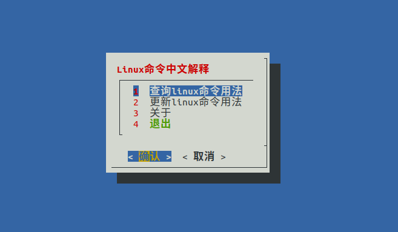
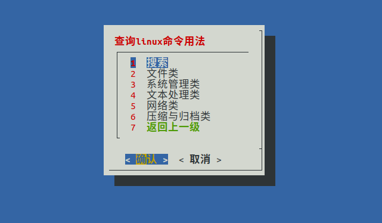
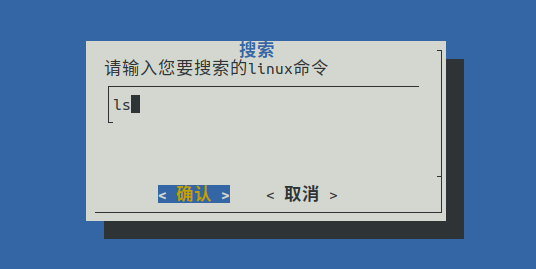
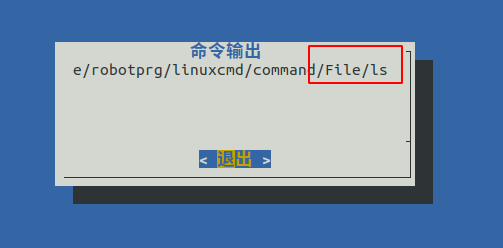
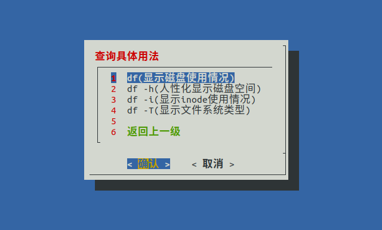
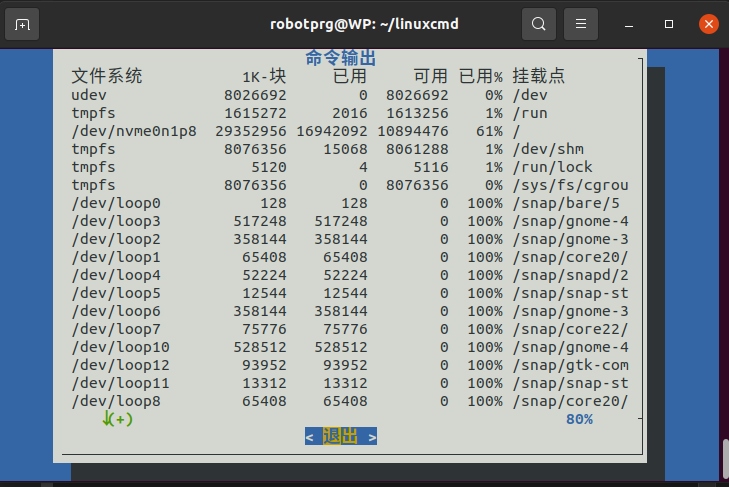
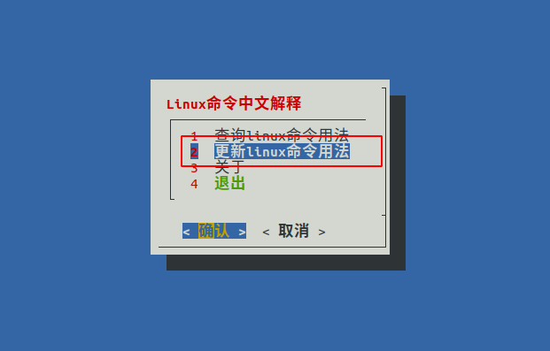

# Linux命令学习快捷脚本
## 仓库介绍
本仓库主要主要是快捷的学习常用的linux命令，本脚本中主要涉及到了60个常用的linux命令，包含文件类，系统管理类，网络类，文本处理类，压缩与归档类，不需要像浏览文章那样复杂且难以找到需要的命令。  
本脚本采用shell编程中的图形化界面工具Dialog来编写，可以像使用软件一样学习linux命令，而且安装简单，占用空间极小，可帮助你快速的学习你想要的linux命令。
## 目录
- [Linux命令学习快捷脚本](#linux命令学习快捷脚本)
  - [仓库介绍](#仓库介绍)
  - [#仓库结构](#仓库结构)
  - [安装配置](#安装配置)
  - [使用方法](#使用方法)
    - [查询linux命令用法](#查询linux命令用法)
    - [更新linux命令用法](#更新linux命令用法)
    - [关于](#关于)
  - [注意事项](#注意事项)
  - [联系](#联系)
# 仓库结构
```
├── configure.sh  #脚本的配置文件
 ├── core          #核心文件
 │   ├── bash      
 │   │   ├── File.sh #外部文件函数
 │   │   ├── lcmd.sh #脚本执行文件
 │   │   ├── Net.sh  #外部文件函数
 │   │   ├── System.sh #外部文件函数
 │   │   ├── Text.sh #外部文件函数
 │   │   └── Zip.sh  #外部文件函数
 │   └── command  #存储命令的txt文件
 │       ├── File
 │       ├── Net
 │       ├── System
 │       ├── Text
 │       └── zip
 ├── image   #图像文件
 │   ├── 2025-06-27-21-31-51.png
 │   ├── 2025-06-27-21-34-06.png
 │   ├── 2025-06-28_12-19.png
 │   ├── 2025-06-28_12-45.png
 │   ├── 3.png
 │   ├── 5.png
 │   ├── 7.png
 │   ├── 9.png
 │   └── 图片.png
 ├── README.md #仓库介绍
 └── update.sh #更新文件
```
## 安装配置
首先需要安装git
```shell
sudo apt install git
```
从远程仓库中安装脚本,将安装包放在**主目录**中
```shell
cd /home/$USER && git clone https://gitee.com/rqtzbot/linuxcmd.git
```
进入安装包中并赋予脚本权限
```shell
cd /home/$USER/linuxcmd
sudo chmod +x configure.sh 
```
执行脚本配置
```shell
./configure.sh
```
重启终端后输入以下命令开始使用
```shell
lcmd
``` 
  


## 使用方法
按ctrl+c可以快捷返回上一级，在最高级选择**退出**即可关闭程序
### 查询linux命令用法
  
**搜索**    


在输入框中输入linux命令即可搜索，若返回为空则没有，若返回路径即为存在
   
输出    


1. File为文件类
2. system为系统管理类
3. Text为文本处理类
4. Net为网络类
5. zip为压缩与文档类  

选择一个命令进入  


1. **查询选项用法**是显示命令的选项
2. **查询具体用法**是显示命令的具体用法  

**具体用法**



选择一个回车之后，会显示该命令的输出  


 
### 更新linux命令用法

更新linux命令用法(该功能会从远程仓库中更新linux命令用法)


### 关于
- [CSDN] https://blog.csdn.net/m0_75192474?spm=1010.2135.3001.5343
- [GitHup] https://github.com/Rqtzbot/linuxcmd
- [Gitee] https://gitee.com/rqtzbot/linuxcmd
## 注意事项
- [放置位置] 应该将下载的linuxcmd包放在您的主目录中
- [系统支持] 目前只在ubuntu/Debian系统上测试使用过
## 联系
邮箱 rqtzfuntop@163.com
